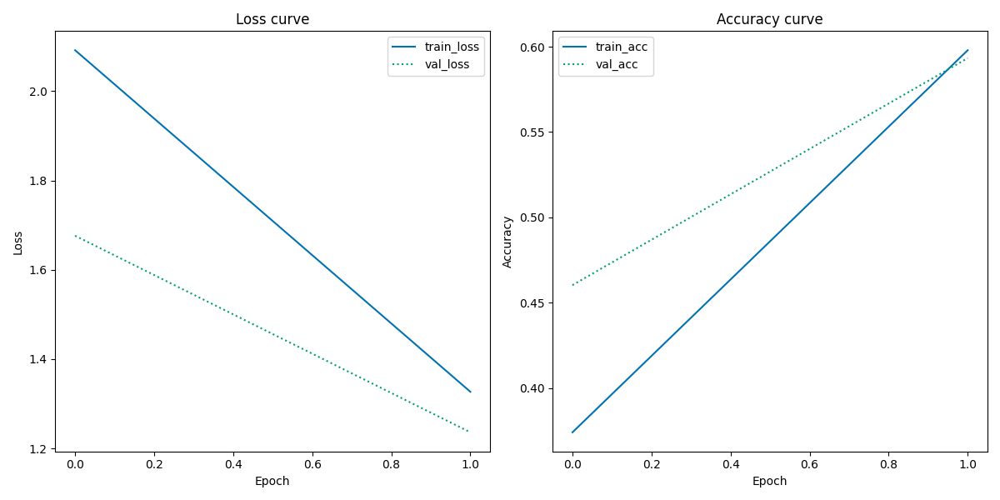

# Visual analytics assignment 3
This repository is assignment 3 out of 4, to be sumbitted for the exam of the university course [Visual Analytics](https://kursuskatalog.au.dk/en/course/115695/Visual-Analytics) at Aarhus Univeristy.

The first section describes the assignment task as defined by the course instructor. The section __Student edit__ is the student's description of how the repository solves the task and how to use it.

## Using pretrained CNNs for image classification

For this assignment, we're going to be working with an interesting kind of cultural phenomenon - fashion. On UCloud, you have access to a dataset of *Indo fashion* taken from this [Kaggle dataset](https://www.kaggle.com/datasets/validmodel/indo-fashion-dataset). There is a paper which goes along with it on *arXiv.org*, which you can read [here](https://arxiv.org/abs/2104.02830).

Your instructions for this assignment are short and simple:

- You should write code which trains a classifier on this dataset using a *pretrained CNN like VGG16*
- Save the training and validation history plots
- Save the classification report

## Student edit
### Solution
The code written for this assignment is found in ```classification.py``` within the ```src``` folder. ```classification.py``` is designed to be run from the terminal and _assumes that src is the working directory_. See ```python3 classification.py --help``` for instructions on usability. The script trains a neural network on top of VGG16 (i.e., transfer learning) to classify images of Indian clothing into different types of clothing. The script outputs the following:
- Plots showing loss and accuracy curves for training and validation, saved in ```models```.
- A trained model (gitignored), saved in ```models```.
- A text file indicating model parameters set from the terminal by the user, saved in ```models```.
- A classification report in ```reports```.

### Results
The model was trained twice with differing parameters - see ```txt```-files in ```models``` for specifications. Due to restricted time resources both models were only trained briefly with one (model_1) and two (model_2) epochs, respectively. 
- model_1 accuracy: 0.69
- model_2 accuracy: 0.59

The plot below shows training history for model_2 (the history of model_1 cannot be plotted as it only has one epoch). Clearly, the model has potential for improving if trained for more epochs.



### Setup
Dowload the data from [here](https://www.kaggle.com/datasets/validmodel/indo-fashion-dataset) and make sure to save it in ```data```. Remember to unzip the downloaded folder.

The script requires the following to be run from the terminal:

```shell
bash setup.sh
```

This will create a virtual environment, ```assignment3_env``` (git ignored), to which the packages listed in ```requirements.txt``` will be downloaded. __Note__, ```setup.sh``` works only on computers running POSIX. Remember to activate the environment running the following line in a terminal before changing the working directory to ```src``` and running ```classification.py```.

```shell 
source ./assignment3_env/bin/activate
```